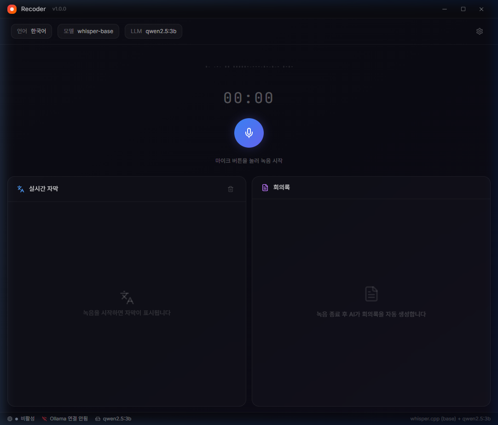

<div align="center">

# 🎙️ Scriba

**AI 회의록 자동 생성 데스크톱 앱**

실시간 음성 녹음 → 자동 텍스트 변환 → AI 회의록 생성

모든 처리가 **로컬**에서 이루어집니다. 인터넷 없이, 개인정보 걱정 없이.

<br />



<br />

[](https://www.electronjs.org/)
[](https://react.dev/)
[](https://github.com/ggerganov/whisper.cpp)
[](https://ollama.com/)
[](#license)

</div>

---

## ✨ 주요 기능

| 기능 | 설명 |
|------|------|
| 🎤 **실시간 녹음** | 마이크 선택 및 실시간 음성 캡처 |
| 📝 **음성→텍스트 (STT)** | whisper.cpp로 5초 단위 실시간 자막 생성 |
| 🤖 **AI 회의록** | Ollama 로컬 LLM이 회의 내용을 분석하여 체계적인 회의록 자동 생성 |
| 🔒 **100% 로컬 처리** | 모든 음성·텍스트 데이터가 내 컴퓨터에서만 처리됨 |
| 🌐 **다국어 지원** | 한국어, English, 日本語, 中文 음성 인식 |
| 📋 **복사 & 다운로드** | 생성된 회의록을 클립보드 복사 또는 Markdown 파일로 저장 |

## 🏗️ 기술 스택

```
┌─────────────────────────────────────────────────────┐
│  Renderer (React + Vite + TailwindCSS 4)            │
│  ┌───────────┐ ┌──────────┐ ┌───────────────────┐   │
│  │ Recording │ │Transcript│ │  Meeting Minutes  │   │
│  │  Control  │ │  Panel   │ │      Panel        │   │
│  └─────┬─────┘ └────┬─────┘ └────────┬──────────┘   │
├────────┼────────────┼────────────────┼──────────────┤
│  Preload (contextBridge + IPC)                      │
├────────┼────────────┼────────────────┼──────────────┤
│  Main Process (Electron)                            │
│  ┌─────┴─────┐ ┌────┴────┐  ┌───────┴──────────┐   │
│  │ Web Audio │ │ Whisper │  │   Ollama REST    │   │
│  │  API PCM  │ │ .cpp    │  │   API Stream     │   │
│  └───────────┘ └─────────┘  └──────────────────┘   │
└─────────────────────────────────────────────────────┘
```

- **데스크톱**: Electron + electron-vite
- **프론트엔드**: React 18, TailwindCSS 4, Motion (Framer Motion)
- **음성인식**: [whisper.cpp](https://github.com/ggerganov/whisper.cpp) via [@fugood/whisper.node](https://www.npmjs.com/package/@fugood/whisper.node)
- **회의록 생성**: [Ollama](https://ollama.com/) 로컬 LLM (REST API 스트리밍)
- **오디오**: Web Audio API → PCM 16-bit mono 16kHz 변환

## 🚀 시작하기

### 사전 요구사항

- **Node.js** 18+ 
- **Ollama** 설치 및 실행 ([ollama.com](https://ollama.com/download))

```bash
# Ollama 설치 후 모델 다운로드
ollama pull qwen2.5:3b
```

### 설치 및 실행

```bash
# 저장소 클론
git clone https://github.com/ksyee/Scriba.git
cd Scriba

# 의존성 설치
npm install --legacy-peer-deps

# 개발 모드 실행
npm run dev
```

> 💡 **첫 실행 시** Whisper base 모델(~150MB)이 자동으로 다운로드됩니다.  
> 저장 위치: `%APPDATA%/scriba/models/`

### 프로덕션 빌드

```bash
npm run build
```

## 🎯 사용법

1. **마이크 선택** — ⚙️ 설정에서 사용할 마이크를 선택합니다
2. **녹음 시작** — 🎙️ 버튼을 클릭하면 실시간 자막이 생성됩니다
3. **녹음 종료** — ⏹ 버튼을 클릭합니다
4. **회의록 생성** — 회의록 패널에서 "회의록 생성" 버튼을 클릭합니다
5. **저장** — 생성된 회의록을 복사하거나 Markdown 파일로 다운로드합니다

## ⚙️ 설정 옵션

| 설정 | 옵션 | 기본값 |
|------|------|--------|
| **마이크** | 시스템에 연결된 오디오 입력 장치 | 기본 장치 |
| **인식 언어** | 한국어 · English · 日本語 · 中文 | 한국어 |
| **Whisper 모델** | `base` (~150MB) · `small` (~500MB) · `medium` (~1.5GB) | base |
| **Ollama 모델** | 설치된 Ollama 모델 자동 감지 | qwen2.5:3b |

> ⚡ CPU만으로도 동작합니다. GPU가 없어도 `base` 모델과 `qwen2.5:3b`으로 원활하게 사용 가능합니다.

## 📁 프로젝트 구조

```
src/
├── main/                      # Electron 메인 프로세스
│   ├── index.ts               #   앱 진입점, IPC 핸들러
│   └── services/
│       ├── whisper.ts          #   Whisper STT 서비스
│       └── ollama.ts           #   Ollama LLM 서비스
├── preload/
│   └── index.ts               # IPC 브릿지 (contextBridge)
└── renderer/                  # React 렌더러
    └── src/
        ├── app/
        │   ├── App.tsx         #   메인 앱 (오디오 캡처 + 상태 관리)
        │   └── components/
        │       ├── title-bar.tsx
        │       ├── recording-control.tsx
        │       ├── transcript-panel.tsx
        │       ├── minutes-panel.tsx
        │       └── status-bar.tsx
        └── styles/             #   다크 테마 + TailwindCSS 4
```

## 🔧 트러블슈팅

<details>
<summary><strong>"마이크를 찾을 수 없습니다"</strong></summary>

- 마이크가 물리적으로 연결되어 있는지 확인
- Windows 설정 → 개인 정보 → 마이크에서 앱 접근 허용 확인
- ⚙️ 설정에서 올바른 마이크가 선택되어 있는지 확인
</details>

<details>
<summary><strong>"Ollama 연결 안됨"</strong></summary>

- Ollama가 실행 중인지 확인: `ollama serve`
- 기본 포트(11434)로 접근 가능한지 확인: `curl http://localhost:11434`
- 모델이 설치되어 있는지 확인: `ollama list`
</details>

<details>
<summary><strong>Whisper 모델 로딩 실패</strong></summary>

- `%APPDATA%/scriba/models/` 폴더의 모델 파일이 손상되지 않았는지 확인
- 모델 파일 삭제 후 앱 재시작하면 자동으로 다시 다운로드됩니다
</details>

## 📄 License

MIT © 2025
